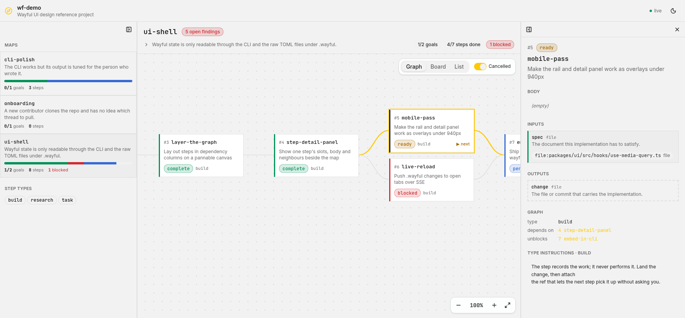
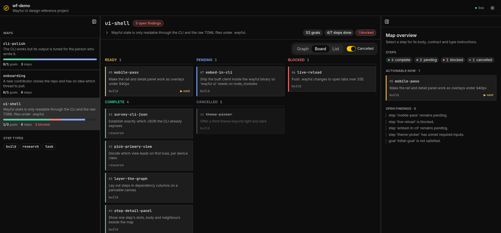
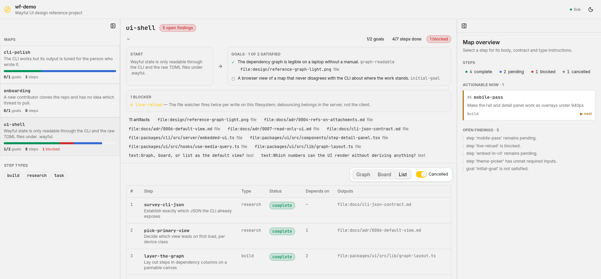

# Wayful UI

A rough design guideline, not a finished design system. It records the identity
the UI already has so new surfaces land in the same place; it deliberately stops
short of specifying every component. Values are taken from
`packages/ui/src/styles.css`, `src/lib/graph-layout.ts`, `src/lib/viewport.ts`
and `src/hooks/use-media-query.ts` — those files stay canonical where this
document drifts.

Reference screenshots, all captured from the running app:

| | |
|---|---|
|  | The default surface: dependency graph on a dot grid, step detail panel on the right, map rail on the left. |
|  | The same map as a status board, in dark. |
|  | The expanded map header — start, goals, blockers, artifacts — above the list view. |

## Overview

Wayful's UI is a **read-only instrument panel for work that lives somewhere
else**. The CLI and the `.wayful` files are the source of truth; the UI never
writes, and it derives almost nothing — `displayStatus()` turning a pending step
into `ready` when `map next` named it is the single exception. That constraint is
the design brief: the interface has to look like something you *read*, not
something you operate.

So the chrome gets out of the way. The shell is three neutral columns — maps,
the map, one step — separated by hairline borders rather than cards floating in
space. Typography does the ranking, borders do the grouping, and the only
saturated colour anywhere on screen is the status of a step. A screen with
nothing blocked is almost entirely grey.

The second thread is **cartographic**: this is a map, so the graph is a pannable
canvas over a fixed dot grid, steps are nodes with a start and a goal terminus at
either end, and the language throughout is waypoints and destinations rather than
tickets and columns.

The third is **the CLI showing through**. Every identifier a person could type
into `wayful` — step names, types, refs, ids, slot names — is set in monospace.
Prose about those identifiers is set in the sans stack. You can tell at a glance
which words are real handles and which are description.

## Colors

Authored in OKLCH throughout. The palette is two-tier and the split is the whole
idea.

**Tier one is achromatic.** Backgrounds, surfaces, borders and text carry chroma
exactly `0`. Light mode sits the app on `oklch(0.96 0 0)` and floats
`oklch(1 0 0)` cards on it; dark mode inverts to `oklch(0.16 0 0)` with
`oklch(0.23 0 0)` cards. Borders are `oklch(0.9 0 0)` / `oklch(0.32 0 0)`, one
step off their background and nothing more. Nothing in the chrome competes for
attention.

**Tier two is status**, and it is the only place colour is allowed to mean
something. Light, then dark:

| status | light | dark | reading |
|---|---|---|---|
| complete | `oklch(0.58 0.14 158)` | `oklch(0.81 0.16 163)` | done, not coming back |
| ready | `oklch(0.58 0.13 70)` | `oklch(0.84 0.13 80)` | `map next` says you can pick it up |
| pending | `oklch(0.55 0.17 262)` | `oklch(0.75 0.13 265)` | waiting on a dependency |
| blocked | `oklch(0.56 0.2 25)` | `oklch(0.73 0.15 22)` | stopped, and owed an explanation |
| cancelled | `oklch(0.6 0.02 258)` | `oklch(0.6 0.02 258)` | deliberately the least visible |

Status colours are authored **separately per theme** rather than shared, because
a hue that holds contrast at `L 0.96` does not hold it at `L 0.16`. The light set
sits around `L 0.55–0.58`; the dark set lifts to `L 0.73–0.84` and sheds chroma.
Cancelled is the one status with the same value in both, because it is supposed
to recede either way.

Mechanically, every status-bearing element carries `data-status`, which sets a
single `--status` variable; a card stripe, a pill, a progress segment and a graph
edge all tint from that one source. Tints are derived, never hand-picked:
`color-mix(in oklab, var(--status) 16%, transparent)` for fills and `45%` for
borders.

**Primary is amber** — `oklch(0.86 0.176 89.2)` — and it is not a brand fill. It
is the highlight: `--ring`, the selected-step ring, the graph edges into and out
of the selected node, the compass mark, the live toggle. Its foreground is
`oklch(0.2 0 0)`, never white. Along with `--primary-foreground`, `--ring` (which
is just primary again) and cancelled, it is one of the few values **identical in
light and dark** — selection should feel like the same gesture in both themes.

## Typography

Two variable families, both chosen for legibility at the small sizes this UI
actually uses:

- **Sans — `Inter Variable`.** Descriptions, prose, headings, everything a person
  wrote for another person. Inter was drawn for interfaces at small sizes: a tall
  x-height and open apertures keep 11–12px text readable, which matters when most
  of the app sits there.
- **Mono — `JetBrains Mono Variable`.** Step names, step types, ids, slot names,
  refs, counts, zoom percentages, and any command a person might paste. It has
  the tallest x-height of the code monos and separates `0`/`O` and `1`/`l`/`I`
  unambiguously — non-negotiable when a mistyped step name is a failed CLI
  command.

Both are **self-hosted** via `@fontsource-variable/*` and declared in
`styles.css`:

```css
@theme {
  --font-sans: "Inter Variable", -apple-system, BlinkMacSystemFont, …;
  --font-mono: "JetBrains Mono Variable", ui-monospace, SFMono-Regular, …;
}
```

Self-hosting is a requirement, not a preference: `wayful ui` serves the built
client from inside the binary, so a font CDN would make the embedded UI depend on
the network. The old platform stack is kept behind each face, so a failed load
degrades to the previous look rather than to Times.

Fontsource ships `font-display: swap`, so there is a brief FOUT on a cold cache.
Inter's metrics are close to the system fallbacks, which keeps the reflow small,
but this is a real change from the flash-free behaviour the UI had when it used
platform fonts only.

The rule to carry forward: **if a user could type it into the CLI, set it in
mono.** That is why a step name is `font-mono text-[13px] font-medium` while its
description directly underneath is `text-xs` sans, and why the rail's numbers
(`1/2` goals, `8` steps) are mono inside sans sentences.

The scale in use, end to end:

| token | size | where |
|---|---|---|
| `map-title` | `text-lg` 1.125rem / 600, mono | the map name — the largest text in the app |
| `panel-title` | `text-base` 1rem / 600 | "Map overview", the selected step's name (mono) |
| `body-sm` | `text-sm` 0.875rem / 400 | project name and description, step description in the detail panel |
| `step-name` | 13px / 500, mono | step and map card titles |
| `body-xs` | `text-xs` 0.75rem / 400, `leading-snug` 1.375 | card descriptions, goals, blockers |
| `prose-xs` | `text-xs` / 400, `leading-relaxed` 1.625 | step body and type instructions |
| `label-caps` | 11px / 600, uppercase, `tracking-wide` 0.025em | every section heading |
| `meta-mono` | 11px / 400, mono | step ids, types, counts |

Density is the point: a map is a lot of small facts, and the UI would rather fit
another step on screen than make this one bigger. Nothing is set above 1.125rem
and nothing below 11px.

One consequence of JetBrains Mono worth designing around: it is wider than the
platform mono it replaced, so a long step name eats more of the 218px graph node
than it used to. Mono strings are the thing most likely to truncate — give them
the width when a layout has to choose.

`label-caps` is the one heading form worth naming explicitly. It marks every
section boundary in the app — `STEPS`, `INPUTS`, `ACTIONABLE NOW`, `GOALS`,
`START`, `TYPE INSTRUCTIONS` — in `text-muted-foreground`, and does the work a
heavier heading weight would otherwise do.

## Layout

Three resizable columns under a fixed `h-14` (56px) top bar:

```
┌────────────────────────────────────────────────────────┐
│ top bar · project · live status · theme          56px  │
├───────────┬─────────────────────────────┬──────────────┤
│ map rail  │ map header                  │ step detail  │
│ 20%       │ ─────────────────────────── │ 30%          │
│ 15–35%    │ graph / board / list        │ 20–55%       │
└───────────┴─────────────────────────────┴──────────────┘
```

Exact panel sizing, from `__root.tsx` and `maps.$mapName.tsx`: rail
`defaultSize="20%" minSize="15%" maxSize="35%"`, map `70%` with `minSize="40%"`,
detail `30%` with `minSize="20%" maxSize="55%"`. Both side panels are
`collapsible`; the detail panel gets its own 40px (`h-10`) header strip carrying
collapse and close.

Breakpoints are chosen by *behaviour*, not device fashion, and live in one place
(`BREAKPOINTS`):

- **`max-width: 1200px`** — the step detail panel becomes an overlay sheet
  (`w-96`, 384px, on the right).
- **`max-width: 940px`** — the map rail becomes a left sheet (`w-72`, 288px).
- **`max-width: 720px`** — a dependency graph stops being readable, so the board
  leads and the detail sheet comes up from the bottom at `h-[80vh]`.

Spacing is a 4px grid, used sparingly: `p-2.5` (10px) inside cards, `p-4` (16px)
inside panels, `space-y-5` (20px) between panel sections, `gap-3` (12px) between
board columns. The board itself is
`grid-cols-[repeat(auto-fill,minmax(230px,1fr))]`.

The graph canvas has its own geometry, all of it in `GRAPH`:

```ts
nodeWidth: 218, nodeHeight: 108,
columnGap: 78,  rowGap: 18,
terminusWidth: 168, terminusHeight: 88,
pad: 22,
```

It sits on a 22px dot grid — `radial-gradient(circle, color-mix(in oklab,
var(--foreground) 16%, transparent) 1px, transparent 1px)` at `22px 22px` —
**fixed to the viewport rather than the canvas**, so the grid reads as the
surface the map rests on rather than something drawn into world space.

Zoom is clamped to `[0.15, 2.5]`, the opening view floors at `LEGIBLE_SCALE =
0.55` (below that node labels stop being words), and panning always keeps
`PAN_MARGIN = 90px` of canvas on screen.

Controls that belong to the canvas float over it rather than consuming a toolbar
row: view switcher and cancelled toggle at `top-3 right-3`, zoom HUD at
`bottom-3 right-3`.

## Elevation & Depth

This is a **flat, border-first system**. Hierarchy comes from three things, in
order: a 1px border, a background step (`background` → `card` → `muted`), and
only then a shadow.

Shadows are reserved for things genuinely *above* the canvas — the floating view
switcher, the zoom HUD, the rail-reveal button — all `shadow-sm` paired with
`bg-card/90` and `backdrop-blur` so the canvas shows through. Buttons carry
`shadow-xs`; a step card lifts to `hover:shadow-md`. That is the entire shadow
vocabulary.

Depth cues that do more work here than shadows do:

- **`border-l-[3px]` in `var(--status)`** down the left edge of every step card.
  This is the primary status signal; the pill is the label for it.
- **Dashed borders mean absent.** An unfilled required slot is `border-2
  border-dashed`; a filled one is a solid border with the status stripe. The
  start and goal termini are dashed because they are context, not work.
- **Opacity means gone.** Cancelled steps drop to `opacity-60` and strike
  through; dimmed graph edges go `opacity-40` with `stroke-dasharray: 4 4`.
- **Stroke weight means relevance.** Graph edges are `1.5` normally and `2.5` in
  `stroke-primary` when they touch the selected node.
- **Backdrop blur** marks the boundary between floating chrome and canvas.

## Shapes

The scale derives from `--radius: 0.75rem`:

```css
--radius-sm: calc(var(--radius) - 4px);  /*  8px */
--radius-md: calc(var(--radius) - 2px);  /* 10px */
--radius-lg: var(--radius);              /* 12px */
--radius-xl: calc(var(--radius) + 4px);  /* 16px */
```

The identity, though, is in **where radius is withheld**:

- **Square (0px): data.** Step cards, map cards in the rail, the list table, slot
  boxes. Anything that is a record of something real has sharp corners — and
  square corners are what let cards sit flush in a dense column.
- **Rounded (`md` 10px / `lg` 12px): chrome.** Floating toolbars and the zoom
  HUD (`rounded-lg`), waypoint and terminus blocks (`rounded-lg`), prose blocks,
  pills, chips, buttons (`rounded-md`), the tabs list (`rounded-lg` with
  `p-[3px]` and `rounded-md` triggers).
- **`full`: dots and bars.** The live-status dot and legend dots (`size-1.5
  rounded-full`), the map progress bar in the rail (`h-1.5 rounded-full`).

If you are adding a surface and cannot decide: does it *hold user data*? Square.
Does it *let you act on the view*? Rounded.

## Components

Only the identity-carrying ones are pinned down here. The rest are shadcn/ui
(`new-york` style, `baseColor: slate`, lucide icons) at their defaults, and
should stay that way.

**Step card** (`step-card.tsx`) — the atom of the app, identical in the graph,
the board, and the overview panel. `bg-card`, square, `p-2.5`, `border` with
`border-l-[3px] border-l-[var(--status)]`, and a fixed reading order: mono `#id`
+ mono name, then a `line-clamp-2` description, then a footer of status pill +
type + `▶ next` in `text-status-ready` when the step is actionable. It is always
a `Link` — selecting a step is a URL change, never local state — and carries
`aria-[current]:ring-primary ring-2` when selected. In dense contexts
(`compact`) the pill drops out and the stripe alone carries status. In the graph
it is fixed at 218×108.

**Status pill** (`badge.tsx`, `variant="status"`) — mono, lowercase,
`rounded-md`, `px-2 py-0.5`, tinted entirely from `--status`: `16%` fill, `45%`
border, full-strength text. Never a solid block of status colour.

**Section label** — the `label-caps` heading described above. Use it for a new
section rather than inventing a heading weight.

**Floating toolbar / HUD** — `bg-card/90 backdrop-blur`, `border`,
`rounded-lg`, `shadow-sm`, `p-1`, `size-8` ghost icon buttons inside.

**Ref chip** (`ref-chip.tsx`) — `bg-secondary`, `rounded-md`, `px-2 py-0.5`,
a mono ref plus its kind in `text-muted-foreground`. Refs are shown verbatim and
never dereferenced (ADR-0004), so the chip must not imply it is a link.

**Waypoint / terminus** — `bg-muted/40` (header) or `bg-muted/60` (canvas),
`rounded-lg`, `p-3`/`p-2.5`, dashed on the canvas. These are the map's two ends,
not steps, and they should never look like step cards.

**Buttons** — shadcn defaults: `h-9` default, `h-8` sm, `h-10` lg, `size-9` /
`size-8` icon. Ghost is the workhorse; `default` (amber) is rare by design.

## Do's and Don'ts

**Do**

- Let `data-status` set `--status` and drive every tint from it. One variable,
  one source of truth, and `color-mix` for the derived fills.
- Set CLI-typeable identifiers in mono and prose in sans.
- Reach for a border or a background step before a shadow.
- Put any state a person can reach into the URL — view, cancelled toggle and
  selected step are all search params, so every screen is shareable.
- Author status colours per theme and check both.

**Don't**

- Don't add a third accent colour. Amber is the highlight; status owns the rest.
- Don't fill large areas with a status colour — stripes, pills and derived tints
  only.
- Don't round data surfaces. Square corners on cards and tables are deliberate.
- Don't link a font from a CDN. Fonts are self-hosted through Fontsource because
  the client ships inside the `wayful` binary and has to work offline.
- Don't add a third family. Two is the whole system, and the sans/mono split is
  load-bearing — it is what tells prose from CLI handles.
- Don't add controls that imply writing. The UI is read-only; a button that
  looks like it mutates a map is a lie.
- Don't derive numbers the CLI already computes. If it is not in `--json`
  output, it does not belong on screen.
